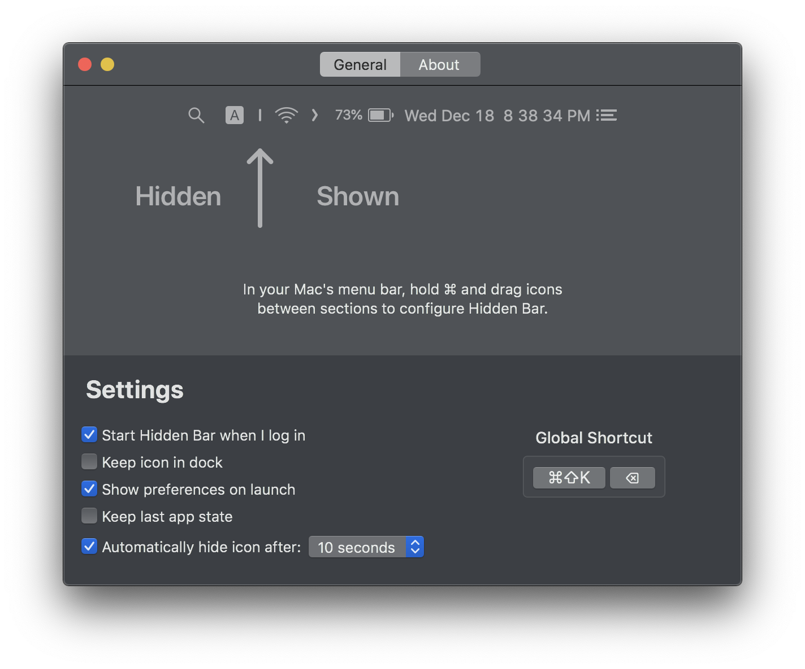
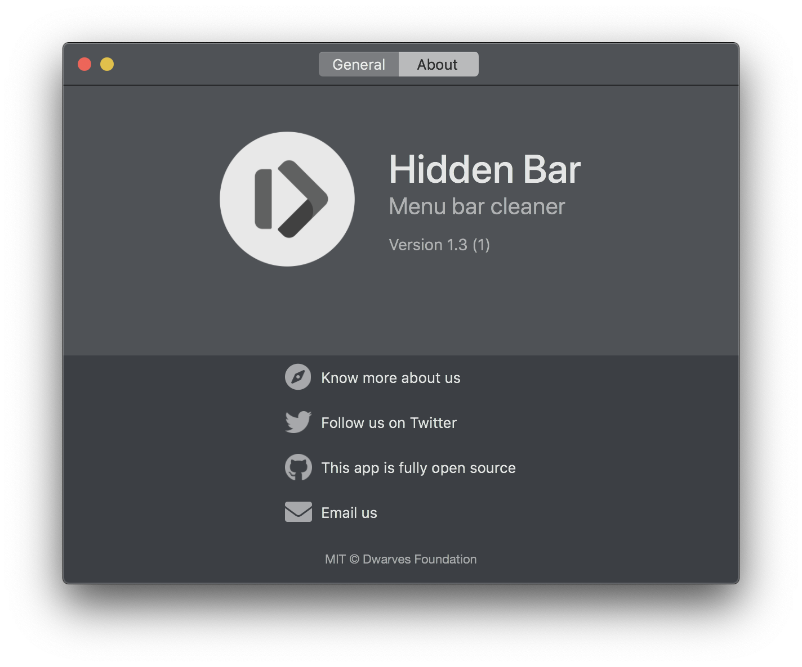
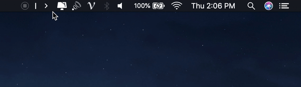

<p align="center">
	
</p>
<p align="center">
	<a href="https://webuild.community">
		
	</a>
	<a href="https://github.com/dwarvesf/hidden/releases/latest">
 		
	</a>
	<a href="https://img.shields.io/badge/platform-macOS-lightgrey.svg">
 		
	</a>
	<a href="https://img.shields.io/badge/requirements-macOS High Sierra+-ff69b4.svg">
 		
	</a>
</p>

## Hidden Bar
Hidden Bar lets you hide menu bar items to give your Mac a cleaner look.

<p align="center">
	
	
</p>

## 🚀 Install

###  App Store

[](https://itunes.apple.com/app/hidden-bar/id1452453066)

### Others

The Hidden Bar is notarized before distributed out side App Store. It's safe to use 👍

#### Using Homebrew

```
brew install --cask hiddenbar
```

#### Manual download

- [Download latest version](https://github.com/dwarvesf/hidden/releases/latest)
- Open and drag the app to the Applications folder.
- Launch Hidden and drag the icon in your menu bar (hold CMD) to the right so it is between some other icons.

## 🕹 Usage

* `⌘` + drag to move the Hidden icons around in the menu bar.
* Click the Arrow icon to hide menu bar items.

<p align="center">
	
</p>

## ✨<a href="https://github.com/dwarvesf/hidden/graphs/contributors">Contributors</a>

This project exists thanks to all the people who contribute. Thank you guys so much 👏

[](https://sourcerer.io/fame/phucledien/dwarvesf/hidden/links/0)[](https://sourcerer.io/fame/phucledien/dwarvesf/hidden/links/1)[](https://sourcerer.io/fame/phucledien/dwarvesf/hidden/links/2)[](https://sourcerer.io/fame/phucledien/dwarvesf/hidden/links/3)[](https://sourcerer.io/fame/phucledien/dwarvesf/hidden/links/4)[](https://sourcerer.io/fame/phucledien/dwarvesf/hidden/links/5)[](https://sourcerer.io/fame/phucledien/dwarvesf/hidden/links/6)[](https://sourcerer.io/fame/phucledien/dwarvesf/hidden/links/7)

Please read [this](CONTRIBUTING.md) before you make a contribution.

## Requirements
macOS version >= 10.13

## You may also like
- [Blurred](https://github.com/dwarvesf/Blurred) - A macOS utility that helps reduce distraction by dimming your inactive noise
- [Micro Sniff](https://github.com/dwarvesf/micro-sniff) - An ultra-light macOS utility that notify whenever your micro-device is being used
- [VimMotion](https://github.com/dwarvesf/VimMotionPublic) Vim style shortcut for MacOS
## License

MIT &copy; [Dwarves Foundation](https://github.com/dwarvesf)
