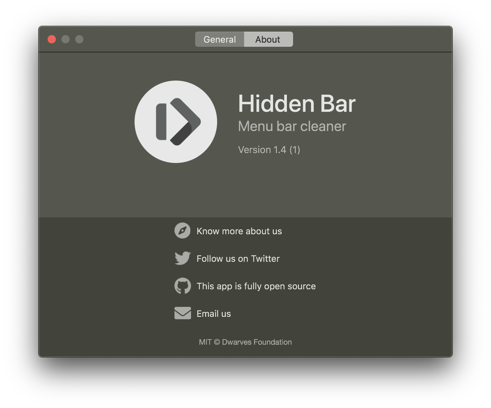

	

	
	

## Hidden Bar (Unofficial Maintenance)
Hidden Bar (Unofficial Maintenance) lets you hide menu bar items to give your Mac a cleaner look.
This is an unofficial maintenance for the discontinued original [Hidden Bar](https://github.com/dwarvesf/hidden).

	
	

## 🚀 Install

###  App Store

This verison of Hidden Bar is not available on the App Store.

Original Version (v1.8): 

### Pre-built Packages

This version of Hidden Bar is NOT notarized. The GateKeeper will flag any non-notarized App as Untrusted and therefore prevent it from opening. Although you can override GateKeeper's decision, it is considered a bad habit while using your computer. Besides notarizing an app requires enrollments of Apple Developer Program, which currently is not the case for me. Therefore NO pre-built packages available.

To test this version of Hidden Bar, you have to build it from source, which means you might also inspect the code yourself.

For packages of the original Hidden Bar (up to v1.9), check out the original repo [here](https://github.com/dwarvesf/hidden).

#### Build from Source

To build this version of Hidden Bar, you have to have Xcode installed.

1. Import the project into Xcode.
2. Reslove the team certificate error. You have to sign your own copies yourself with your own cert. It is not necessary to be a member of Apple Developer Program to build this project.
3. Build the project in Xcode.

## 🕹 Usage

CAUTION: The usage of version of Hidden Bar is slightly different from the original one.

* `⌘` + drag to move the Hidden icons around in the menu bar.
* Click the Arrow icon to hide menu bar items.

For more usage info, click the Help button in the Settings interfaces.

	

## ✨<a href="https://github.com/dwarvesf/hidden/graphs/contributors">Contributions</a>

Please read [this](CONTRIBUTING.md) before you make a contribution.

### Unofficial Maintenance Acknowledgements

Sincere gratitudes towards all contributors of the original Hidden Bar for your previous works.

### Original Acknowledgements

This project exists thanks to all the people who contribute. Thank you guys so much 👏

## Requirements
macOS version >= 10.13

## License

MIT &copy; [UeharaYou](https://github.com/UeharaYou); origional: [Dwarves Foundation](https://github.com/dwarvesf)
