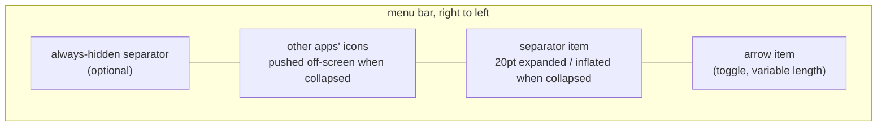

# Architecture

Hidden Bar is a single-process, sandboxed AppKit menubar utility (~1.5k lines of
Swift, one dependency: [HotKey](https://github.com/soffes/HotKey)). There is no
helper app, no daemon, no network. The menu-bar controls and one preferences
window contain the app's behavior.

## The core trick

macOS offers no public API to hide other apps' menubar icons. Hidden Bar uses
status-item geometry to move icons left of its separator out of the visible bar.
On macOS 26 and earlier the separator grows to twice the widest screen width.
On macOS 27 each item must stay below roughly half the narrowest screen width;
additional status items supply the rest of the displacement on wide screens.
macOS 27 moves displaced icons into its native overflow. Expanding returns the
separator to 20pt and the extra items to zero requested width.

Key consequences of this design:

- The menubar replicates on every display. Before macOS 27 the collapse length
  derives from the **widest** screen and is bounded at 10,000pt. On macOS 27
  each item's length derives from the **narrowest** screen so it stays below the
  per-display rejection threshold. The live lengths are recomputed after display
  changes.
- macOS 27's extra items are created only for wide screen layouts. They retain
  their native slots at zero requested width when expanded; toggling
  `isVisible` would reorder them on that system. The number is chosen at launch,
  so a screen width change that needs more slots requires a restart.
- `isCollapsed` is derived state: `separator.length > 20`, deliberately not an
  equality check, so it survives the length being recomputed while collapsed.
- Icons macOS inserts to the LEFT of the separator (where new status items
  appear) are in the hidden zone by default; that is inherent to the trick.

## Topology

- **`AppDelegate`** (entry): registers default prefs, sets up the global hotkey,
  runs the one-shot legacy login-item migration, owns the `StatusBarController`.
- **`StatusBarController`** (the product): the status items,
  collapse/expand, auto-hide timer, interaction-awareness, hover-to-expand,
  self-restore of dragged-off items.
- **`Preferences`** (facade enum): typed accessors over `UserDefaults`; setters
  post `NotificationCenter` notifications that the controller and prefs window
  observe. There is no other state store.
- **`PreferencesViewController` / `PreferencesWindowController`**: the only
  window (storyboard-based), shown on demand from the context menu.

## Behavior layers on the core trick

| Layer | Mechanism | Cost when unused |
|---|---|---|
| Auto-hide | one-shot `Timer` after expand; at fire, if the pointer sits in any screen's menubar band (`visibleFrame.maxY ... frame.maxY`), it re-arms instead of collapsing | none (single point-in-rect check at fire) |
| Hover-to-expand (opt-in) | global `.mouseMoved` monitor + 0.5s dwell timer; installed only when the `hoverToExpand` default is true at launch | zero: monitor not installed |
| Self-restore | `isVisible = true` forced on our items at launch; Cmd-dragging them off otherwise bricks the app (its only UI is those items) | none |
| Always-hidden section | a second separator item; its own length games, gated by `alwaysHiddenSectionEnabled` | item not created |

## Autostart

macOS 13+ `SMAppService.mainApp`: the app registers itself; the login item is
visible and revocable in System Settings > General > Login Items. On first
launch after upgrade, a one-shot migration deauthorizes the legacy
`com.dwarvesv.LauncherApplication` helper registration (the BTM database never
garbage-collects those; see Apple TN3111). The helper app itself is gone.

## Security posture

Sandboxed (`com.apple.security.app-sandbox`), hardened runtime, no network
entitlement, no file I/O, no IPC surface, no shell or subprocess use. The only
dependency is HotKey (a small Carbon `RegisterEventHotKey` wrapper) locked by
the committed `Package.resolved`. The opt-in hover monitor observes pointer
position only and discards event payloads. About-window links are hardcoded.
A full-tree audit (2026-06) scored 9/10 with hygiene-level findings only.

## Known architectural limits

- **The notch**: hidden icons sit "under" the notch area on notched Macs; the
  trick cannot reveal them there. The real fix is a spillover/second-bar design
  (tracked in issues #357/#341/#148; candidate implementations in PRs #350/#358).
- **macOS 27**: a single oversized status item is discarded. The smaller-item
  approach restores ordinary hiding on a 1728pt display, but wide, mixed-width,
  notched and right-to-left layouts still need physical verification. The
  optional always-hidden separator has no additional spacer group and may not
  hide its section on a wide display while the ordinary section is expanded.
- **Other apps' open menus**: interaction-awareness is pointer-position-based;
  a pointer deep inside another app's open dropdown is below the menubar band,
  so the collapse can still fire there.
