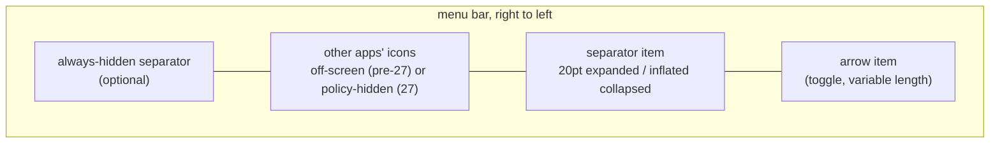
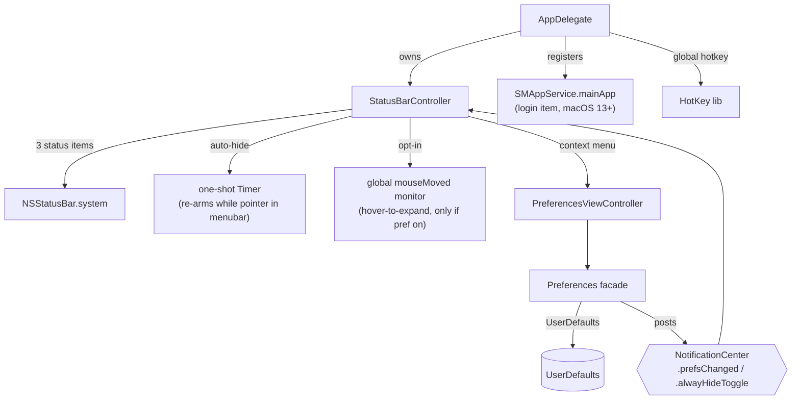

# Architecture

Hidden Bar is a single-process, sandboxed AppKit menubar utility (~1.5k lines of
Swift, one dependency: [HotKey](https://github.com/soffes/HotKey)). There is no
helper app, no daemon, no network. Everything happens inside a handful of
`NSStatusItem`s (arrow, separator, optional always-hidden) and one window.

## The core trick

macOS offers no API to hide other apps' menubar icons. Hidden Bar fakes it with
geometry: a separator status item whose **length is inflated**, shoving every
icon to its left out of the visible bar. Collapsing and expanding is just
flipping that length between ~20pt and the inflated value.

On macOS 26 and earlier the inflated length is roughly twice the widest
attached screen, which pushes those icons off the left edge. macOS 27 is
different: its menu bar is one window with native overflow (`«`), and the
system drops a status item that reaches roughly half a display width. A width
is shared by every display, so no choice of separator length can work reliably
on mixed-size displays.

On macOS 27, when available, Hidden Bar instead uses the runtime assessment
mode policy in the private `MenuBarClientCore.framework`. The policy keeps
system items and Hidden Bar's own bundle visible while temporarily hiding
third-party menu-bar bundles. It is applied by MenuBarAgent on each display,
so it consumes no menu-bar width and does not create a spacer gap or native
overflow. If the runtime interface is absent or rejects the policy, the legacy
separator approach remains as a fallback.

Key consequences of this design:

- The menubar replicates on every display. On macOS 26 and earlier the collapse
  length derives from the **widest** screen (`NSScreen.screens`), never
  `NSScreen.main`, and is re-applied on display hot-plug. The macOS 27 policy
  is display-independent: MenuBarAgent applies the same visibility policy to
  each bar without sharing geometry.
- Pre-27 the length is bounded: `max(500, min(widestFrameWidth * 2, 10_000))`.
  macOS enforces a hard 10,000pt maximum on `NSStatusItem.length`. On 27 each
  item stays under `narrowest/2 - 64`.
- `isCollapsed` is derived from either a live macOS 27 policy assertion or
  `separator.length > 20`; the latter deliberately is not an equality check so
  it survives a length recomputation while collapsed.
- Icons macOS inserts to the LEFT of the separator (where new status items
  appear) are in the hidden zone by default; that is inherent to the trick.

### macOS 27 assessment-mode backend

This backend is deliberately isolated to one small runtime bridge in
`StatusBarController`. It never links against a private framework at build
time. On macOS 27 it loads
`/System/Library/PrivateFrameworks/MenuBarClientCore.framework/MenuBarClientCore`
at runtime, verifies the presence of `MBAssessmentModeConfiguration` and
`MBAssessmentModeAssertion`, and only then creates an assertion. The assertion
is released on expand; releasing it restores the normal menu bar immediately.

The policy's allowlist includes all currently enumerated system-item slots and
Hidden Bar's bundle identifier. Consequently Control Centre, battery, Wi-Fi,
clock, and the Hidden Bar arrow stay reachable while third-party items are
hidden. A completion handler logs rejection but does not crash the app.

This is an undocumented Apple interface. It may change in a macOS 27 point
release, is not suitable for Mac App Store distribution, and must always retain
the geometry fallback. Do not expand the private-interface surface without a
real macOS 27 test: a bad policy can hide the only control that can restore the
bar.

Verified manually on macOS 27 with a 3456pt built-in display and a 2560pt
Thunderbolt display: collapsed and expanded states, repeated toggles, battery
and Control Centre visibility, no spacer gap, and no native overflow chevron.

## Topology

- **`AppDelegate`** (entry): registers default prefs, sets up the global hotkey,
  runs the one-shot legacy login-item migration, owns the `StatusBarController`.
- **`StatusBarController`** (the product, ~370 lines): the three status items,
  collapse/expand, auto-hide timer, interaction-awareness, hover-to-expand,
  self-restore of dragged-off items.
- **`Preferences`** (facade enum): typed accessors over `UserDefaults`; setters
  post `NotificationCenter` notifications that the controller and prefs window
  observe. There is no other state store.
- **`PreferencesViewController` / `PreferencesWindowController`**: the only
  window (storyboard-based), shown on demand from the context menu.

## Behavior layers on the core trick

| Layer | Mechanism | Cost when unused |
|---|---|---|
| Auto-hide | one-shot `Timer` after expand; at fire, if the pointer sits in any screen's menubar band (`visibleFrame.maxY ... frame.maxY`), it re-arms instead of collapsing | none (single point-in-rect check at fire) |
| Hover-to-expand (opt-in) | global `.mouseMoved` monitor + 0.5s dwell timer; installed only when the `hoverToExpand` default is true at launch | zero: monitor not installed |
| Self-restore | `isVisible = true` forced on our items at launch; Cmd-dragging them off otherwise bricks the app (its only UI is those items) | none |
| Always-hidden section | a second separator item; its own length games, gated by `alwaysHiddenSectionEnabled` | item not created |

## Autostart

macOS 13+ `SMAppService.mainApp`: the app registers itself; the login item is
visible and revocable in System Settings > General > Login Items. On first
launch after upgrade, a one-shot migration deauthorizes the legacy
`com.dwarvesv.LauncherApplication` helper registration (the BTM database never
garbage-collects those; see Apple TN3111). The helper app itself is gone.

## Security posture

Sandboxed (`com.apple.security.app-sandbox`), hardened runtime, no network
entitlement, no file I/O, no IPC surface, no shell or subprocess use. The only
dependency is HotKey (a small Carbon `RegisterEventHotKey` wrapper) locked by
the committed `Package.resolved`. The opt-in hover monitor observes pointer
position only and discards event payloads. About-window links are hardcoded.
A full-tree audit (2026-06) scored 9/10 with hygiene-level findings only.

## Known architectural limits

- **The notch**: hidden icons sit "under" the notch area on notched Macs; the
  trick cannot reveal them there. The real fix is a spillover/second-bar design
  (tracked in issues #357/#341/#148; candidate implementations in PRs #350/#358).
- **macOS 27 always-hidden on wide displays**: the always-hidden separator
  still inflates as a single unit, so with the regular section expanded its
  icons can show on a display wider than twice that unit.
- **macOS 27 first launch after upgrade**: items register under `_v27` autosave
  names so spacers land between the arrow and the separator. Icons may need a
  one-time ⌘-drag past the separator, as on a fresh install.
- **Other apps' open menus**: interaction-awareness is pointer-position-based;
  a pointer deep inside another app's open dropdown is below the menubar band,
  so the collapse can still fire there.
