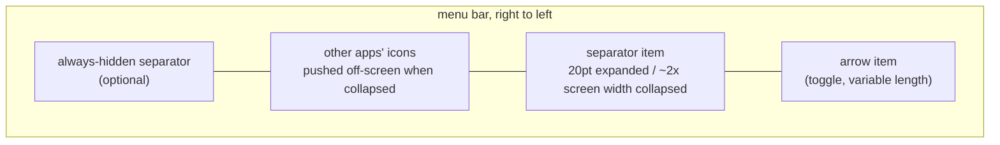
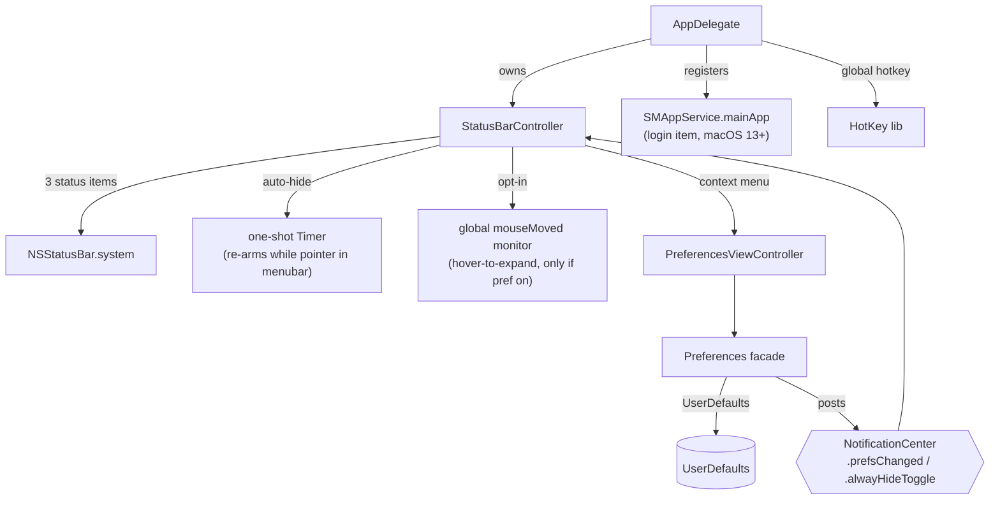

# Architecture

Hidden Bar is a single-process, sandboxed AppKit menubar utility (~1.5k lines of
Swift, one dependency: [HotKey](https://github.com/soffes/HotKey)). There is no
helper app, no daemon, no network. Everything happens inside three
`NSStatusItem`s and one window.

## The core trick

macOS offers no API to hide other apps' menubar icons. Hidden Bar fakes it with
geometry: a separator status item whose **length is inflated to roughly the
width of the widest attached screen**, shoving every icon to its left off-screen.
Collapsing and expanding is just flipping that length between ~20pt and the
inflated value.

Key consequences of this design:

- The menubar replicates on every display, so the collapse length derives from
  the **widest** screen (`NSScreen.screens`), never `NSScreen.main`, and is
  re-applied to the live item on `didChangeScreenParametersNotification`
  (display hot-plug).
- The length is bounded: `max(500, min(widestFrameWidth * 2, 10_000))`. macOS
  enforces a hard 10,000pt maximum on `NSStatusItem.length`.
- `isCollapsed` is derived state: `separator.length > 20`, deliberately not an
  equality check, so it survives the length being recomputed while collapsed.
- Icons macOS inserts to the LEFT of the separator (where new status items
  appear) are in the hidden zone by default; that is inherent to the trick.

### macOS 27 adjustments

macOS 27 rebuilt the menu bar and broke the trick in two independent ways (#360).
Both are handled in `StatusBarController`, gated behind `#available(macOS 27.0, *)`;
macOS 26 and earlier keep the original code path.

1. **An over-wide item is dropped.** macOS 27 discards a status item whose backing
   window (`length` plus 16pt of chrome) reaches half the display width, where
   earlier versions clamped it. The pre-27 length of twice the widest screen is
   over that limit on every Mac, so the separator was ejected from the layout: it
   displaced nothing, and nothing in-process reported the ejection -- the item
   keeps reporting whatever length it was given. The collapse length is therefore
   derived from the **narrowest** attached screen (`width / 2 - 16 - 24`), the
   inverse of the pre-27 widest-screen rule, because one length is applied on
   every display's bar while the limit is per display.
2. **A seated neighbour is never evicted.** Assigning the collapsed length in one
   jump leaves every other icon exactly where it was. The same total applied in
   small steps does carry them along, so a macOS 27 *growth* ramps in 40pt steps
   (`setLength`). Shrinking needs no ramp on any macOS: room becomes free and the
   host repacks on its own.

Measured on 27.0 build 26A428, 1728pt display: 848pt hides, 849pt hides nothing
(848 + 16 == 864 == 1728 / 2); a single-jump growth moved neighbours 0pt while
10pt and 40pt steps moved them out of the bar. The same arithmetic fits the
3008pt-display report in PR #392 (honored at 1480pt, dropped at 1500pt).

#### Proving the length instead of trusting it

That cliff has only been measured on two display widths, and a formula that
overshoots it fails the way #360 failed: silently. So the first collapse on each
display configuration *proves* the length with a *canary* -- a one-point,
transparent status item registered last, which lands among the icons the collapse
has to clear. An honored length carries it to the region's left edge; an ejected
one leaves it where it sat. Failing that, the request drops by a quarter and the
collapse is retried, up to six times.

Two things make the canary work, and both cost a measurement to learn:

- **Travel is the signal, not position.** When the separator clamps against the
  region's left edge, a canary holding a live slot and a parked one come to rest
  within a few points of each other. The edge-jump signal proposed in PR #400 is
  likewise unusable: the separator's arrow-facing edge starts moving at 600pt on a
  bar that still hides correctly at 840pt, because a clamped item grows out past
  the arrow.
- **The canary must seat first.** A freshly registered item yields to the
  separator's claimed span whether or not that span is honored. At 0.35s the canary
  travelled on a 964pt request that hid nothing; at 1.0s it stayed put and the
  retry found 723pt.

The canary is removed as soon as the answer is in, so it is never in the bar while
the app is idle. A bar too full to give it a slot leaves the length unproven and
the formula stands (`canaryStartedAtClamp`).

## Topology

- **`AppDelegate`** (entry): registers default prefs, sets up the global hotkey,
  runs the one-shot legacy login-item migration, owns the `StatusBarController`.
- **`StatusBarController`** (the product, ~370 lines): the three status items,
  collapse/expand, auto-hide timer, interaction-awareness, hover-to-expand,
  self-restore of dragged-off items.
- **`Preferences`** (facade enum): typed accessors over `UserDefaults`; setters
  post `NotificationCenter` notifications that the controller and prefs window
  observe. There is no other state store.
- **`PreferencesViewController` / `PreferencesWindowController`**: the only
  window (storyboard-based), shown on demand from the context menu.

## Behavior layers on the core trick

| Layer | Mechanism | Cost when unused |
|---|---|---|
| Auto-hide | one-shot `Timer` after expand; at fire, if the pointer sits in any screen's menubar band (`visibleFrame.maxY ... frame.maxY`), it re-arms instead of collapsing | none (single point-in-rect check at fire) |
| Hover-to-expand (opt-in) | global `.mouseMoved` monitor + 0.5s dwell timer; installed only when the `hoverToExpand` default is true at launch | zero: monitor not installed |
| Self-restore | `isVisible = true` forced on our items at launch; Cmd-dragging them off otherwise bricks the app (its only UI is those items) | none |
| Always-hidden section | a second separator item; its own length games, gated by `alwaysHiddenSectionEnabled` | item not created |

## Autostart

macOS 13+ `SMAppService.mainApp`: the app registers itself; the login item is
visible and revocable in System Settings > General > Login Items. On first
launch after upgrade, a one-shot migration deauthorizes the legacy
`com.dwarvesv.LauncherApplication` helper registration (the BTM database never
garbage-collects those; see Apple TN3111). The helper app itself is gone.

## Security posture

Sandboxed (`com.apple.security.app-sandbox`), hardened runtime, no network
entitlement, no file I/O, no IPC surface, no shell or subprocess use. The only
dependency is HotKey (a small Carbon `RegisterEventHotKey` wrapper) locked by
the committed `Package.resolved`. The opt-in hover monitor observes pointer
position only and discards event payloads. About-window links are hardcoded.
A full-tree audit (2026-06) scored 9/10 with hygiene-level findings only.

## Known architectural limits

- **The notch**: hidden icons sit "under" the notch area on notched Macs; the
  trick cannot reveal them there. The real fix is a spillover/second-bar design
  (tracked in issues #357/#341/#148; candidate implementations in PRs #350/#358).
- **macOS 27 item placement**: positions moved into the host's layout table.
  `NSStatusItem Preferred Position ...` no longer appears in the app's defaults,
  a re-registered item lands at the far left instead of its old slot, and the app
  cannot read or seed a position. On a busy bar Hidden Bar's own separator can
  land inside the system's native overflow (`»`), where the user can neither see
  it nor tell which icons are in the hidden zone; the only remedy today is a
  one-time ⌘-drag. Hiding itself works (see "macOS 27 adjustments" above).
- **Other apps' open menus**: interaction-awareness is pointer-position-based;
  a pointer deep inside another app's open dropdown is below the menubar band,
  so the collapse can still fire there.
