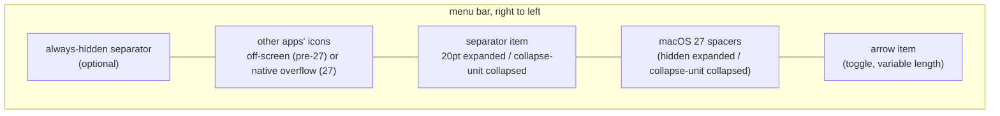
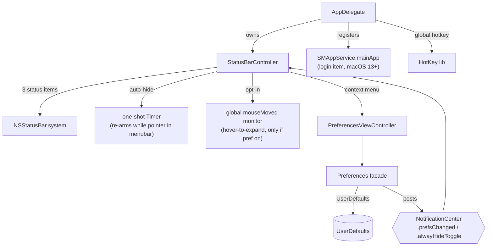

# Architecture

Hidden Bar is a single-process, sandboxed AppKit menubar utility (~1.5k lines of
Swift, one dependency: [HotKey](https://github.com/soffes/HotKey)). There is no
helper app, no daemon, no network. Everything happens inside a handful of
`NSStatusItem`s (arrow, separator, optional always-hidden, plus macOS 27
spacers) and one window.

## The core trick

macOS offers no API to hide other apps' menubar icons. Hidden Bar fakes it with
geometry: a separator status item whose **length is inflated**, shoving every
icon to its left out of the visible bar. Collapsing and expanding is just
flipping that length between ~20pt and the inflated value.

On macOS 26 and earlier the inflated length is roughly twice the widest
attached screen, which pushes those icons off the left edge. On macOS 27 the
menu bar is one window with a native overflow (`«`), and the system **drops**
a status item whose length reaches half the display width. The collapse unit
is therefore sized just under half the **narrowest** attached screen, and
zero-length spacer items between the separator and the arrow inflate with it
so the total span still covers a wide or mixed-width setup. Icons the
separator displaces go into the system overflow menu rather than off-screen.

Key consequences of this design:

- The menubar replicates on every display. On macOS 26 and earlier the collapse
  length derives from the **widest** screen (`NSScreen.screens`), never
  `NSScreen.main`. On macOS 27 it derives from the **narrowest** (the only cliff
  every bar's copy of the item can clear), with spacers covering the rest. It is
  re-applied to the live item on `didChangeScreenParametersNotification`
  (display hot-plug).
- Pre-27 the length is bounded: `max(500, min(widestFrameWidth * 2, 10_000))`.
  macOS enforces a hard 10,000pt maximum on `NSStatusItem.length`. On 27 each
  item stays under `narrowest/2 - 64`.
- `isCollapsed` is derived state: `separator.length > 20`, deliberately not an
  equality check, so it survives the length being recomputed while collapsed.
- Icons macOS inserts to the LEFT of the separator (where new status items
  appear) are in the hidden zone by default; that is inherent to the trick.

## Topology

- **`AppDelegate`** (entry): registers default prefs, sets up the global hotkey,
  runs the one-shot legacy login-item migration, owns the `StatusBarController`.
- **`StatusBarController`** (the product, ~370 lines): the three status items,
  collapse/expand, auto-hide timer, interaction-awareness, hover-to-expand,
  self-restore of dragged-off items.
- **`Preferences`** (facade enum): typed accessors over `UserDefaults`; setters
  post `NotificationCenter` notifications that the controller and prefs window
  observe. There is no other state store.
- **`PreferencesViewController` / `PreferencesWindowController`**: the only
  window (storyboard-based), shown on demand from the context menu.

## Behavior layers on the core trick

| Layer | Mechanism | Cost when unused |
|---|---|---|
| Auto-hide | one-shot `Timer` after expand; at fire, if the pointer sits in any screen's menubar band (`visibleFrame.maxY ... frame.maxY`), it re-arms instead of collapsing | none (single point-in-rect check at fire) |
| Hover-to-expand (opt-in) | global `.mouseMoved` monitor + 0.5s dwell timer; installed only when the `hoverToExpand` default is true at launch | zero: monitor not installed |
| Self-restore | `isVisible = true` forced on our items at launch; Cmd-dragging them off otherwise bricks the app (its only UI is those items) | none |
| Always-hidden section | a second separator item; its own length games, gated by `alwaysHiddenSectionEnabled` | item not created |

## Autostart

macOS 13+ `SMAppService.mainApp`: the app registers itself; the login item is
visible and revocable in System Settings > General > Login Items. On first
launch after upgrade, a one-shot migration deauthorizes the legacy
`com.dwarvesv.LauncherApplication` helper registration (the BTM database never
garbage-collects those; see Apple TN3111). The helper app itself is gone.

## Security posture

Sandboxed (`com.apple.security.app-sandbox`), hardened runtime, no network
entitlement, no file I/O, no IPC surface, no shell or subprocess use. The only
dependency is HotKey (a small Carbon `RegisterEventHotKey` wrapper) locked by
the committed `Package.resolved`. The opt-in hover monitor observes pointer
position only and discards event payloads. About-window links are hardcoded.
A full-tree audit (2026-06) scored 9/10 with hygiene-level findings only.

## Known architectural limits

- **The notch**: hidden icons sit "under" the notch area on notched Macs; the
  trick cannot reveal them there. The real fix is a spillover/second-bar design
  (tracked in issues #357/#341/#148; candidate implementations in PRs #350/#358).
- **macOS 27 always-hidden on wide displays**: the always-hidden separator
  still inflates as a single unit, so with the regular section expanded its
  icons can show on a display wider than twice that unit.
- **macOS 27 first launch after upgrade**: items register under `_v27` autosave
  names so spacers land between the arrow and the separator. Icons may need a
  one-time ⌘-drag past the separator, as on a fresh install.
- **Other apps' open menus**: interaction-awareness is pointer-position-based;
  a pointer deep inside another app's open dropdown is below the menubar band,
  so the collapse can still fire there.
